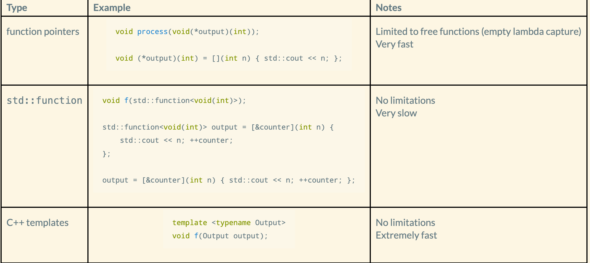

## Lambda Functions

### Be able to write with capture and parameters

| Lambda         | Description                | Parameter      |
|----------------|----------------------------|----------------|
| [](char c) {   | Output character           | IN             |
|    std::cout << c; |                          |                |
| }              |                            |                |
| [](char& c) {  | Convert to uppercase       | IN/OUT         |
|    c = std::toupper(c); |                    |                |
| }             |                            |                |

The captures of a lambda are whatever is within the [], there can be empty captures, or you have have it be when you want to pass in everything, or we can name everything that we pass in, one by one,
#### Lambda: `int` comparison
```C++

[](const void* e1, const void* e2)->int { 
    int n1 = *(int*) e1;
    int n2 = *(int*) e2;
    
    if (n1 < n2)
        return -1;
    else if (n1 > n2)
        return 1;
    else
        return 0;
}
```


## UML Multiplicity

UML multiplicity, generalization (inheritance), composition, and aggregation. Understand the difference between composition and aggregation and when we would use one over the other. Know the UML arrows for them.

| Relationship    | Description             |
|-----------------|-------------------------|
| Dependency      | *uses a*                  |
| Generalization  | *is a*                    |
| Association     | *has a*                  |
| **Aggregation** (Association)     | *has a*                   |
| **Composition** (Association)     | *has a*                   |

#### Composition
  
- Target belongs **only** to the source
- Source (e.g., University) controls the *lifetime* of the target (e.g., College)

*Code:*  
fields/data members of  
- direct type  
- containers  
- pointers/references to objects created (and destroyed) internally  

#### Aggregation


- part of relationship
- special kind of association with roles and mulitplicites often used
- The source (e.g., Club) **doesn't** control the lifetime of the target (e.g., Member)

*Code:*
- Fields (data members) are pointers/references to this type, and the objects are created externally  

---

**Differences:**
- Prefer *Composition* to *Aggregation* as the object's lifetime is clearer
- *Aggregation* has particular roles in more complex relationships, especially with polymorphic data members
- Two are often confused, and terms used interchangeably

## Extension Points
- The points in the program you can register a handler for
- Every extension point has a single handler
- The handler is passed all data as parameters
*Dealing with Handlers*

***note:*** *uhh a lot of this i am putting is incomplete this should all relate to lambdas but im still trying to figure how (maybe look over this for now)*  

*Function pointers* as a handler is limited to free functions  
*`std::function`* as handler has no limits but is very slow
## RAII
### Resource Acquisition Is Initialization

Holding a resource is tied to an object's lifetime

Constructor: Allocate resource
Destructor: Deallocate resource

Prevents resource leaks, double-free, use when invalid

---

#### Why is it important?

- RAII behavior prevents resource errors without any additional burden to the developer  
- Ensures proper behavior  
- Makes the resource much easier to work with, don't have to explicity `close()`  

Thus... all resources should be built with RAII behavior  

---
#### How to implement?  
- Constructor: Allocate resource
- Destructor: Deallocate resource
- Access: Direct access to a resource
- Boolean: Check if the resource exists (i.e., has been allocated and is still valid)
- Copy, Assignment: Transfer resource control to new RAII object
- Deallocate: Deallocate resource before Destructor (safely)


**RAII: `std::ofstream`**
```C++
// non-RAII usage
{
    std::ofstream out;
    
    out.open("output.md");
    
    out << "# RAII" << '\n';
    
    out.close();

```

```C++
// RAII usage
{
    std::ofstream out("output.md");
    
    out << "# RAII" << '\n';
}
```
We use smart pointers
- Smart pointers are automatically initialized with `nullptr`
- Automatic destructor call for deallocation of the contained resource

## SOLID

Know the list of principles, both abbreviations and full names

### Principles 
* **S**ingle Responsibility Principle (SRP)
* **O**pen/closed Principle (OCP)
* **L**iskov Substitution Principal (LSP)
* **I**nterface Segregation Principle (ISP)
* **D**ependency Inversion Principle (DIP)


## Coupling

Degree of interdependence between software modules; a measure of how closely connected two routines or modules are; the strength of the relationships between modules

The goal of **coupling** is to *minimize* external interaction

Types of Coupling
-  Message Coupling *(very best)*
- Data Coupling *(best)* 
- Stamp Coupling  
- Control Coupling  
- Common Coupling
- Content Coupling *(worst)*

Why is coupling important?
- Perhaps the most important characteristics of a system
- Affects development path
- Affects how we partition the system for testing
- Affects how much reuse is possible
- Significant effect on the complexity of a system  
  
*Collard asks about why decoupling is important, originally I thought he asked why coupling so important...*

Why is ***decoupling*** important?
- Zero to minimal coupling
- Very easy to develop/test/maintain/use
- Common refactoring activity
  

## API 

### Application Programming Interface

- Large-scale mechanism for *separation of concerns*
(need to add more, there wasn't much in the slides)  

**Good APIs**
- Low complexity
- High degree of safety
- Flexible enough
- Efficient enough

## PIMPL

### ***P***ointer to ***IMPL***ementation

- *Use a pointer to a class/struct declaration for an implementation class in the target class declaration file (i.e., .hpp)*
- *Define the implementation class in the target class definition file (i.e., .cp*p)*  

**Reasons**  
- Class implementation is hidden  
- Header file containing the class declaration only needs to include those files required for the class interface rather than for its implementation  
---
**Include**
- Implement using a class or struct.  
- Typically, it is a struct since there is no need to keep it private.
- A struct/class declaration forms an incomplete type
std::unique_ptr<> can work with incomplete types (with one issue)  
- std::unique_ptr<> used instead of raw pointer for RAII. I.e., don't depend on the destructor of the class to run
```C++

/*
    Good.hpp
    Declaration of class Good
    Is a good class... but does not have PIMPL
*/

#ifndef INCLUDED_GOOD_HPP
#define INCLUDED_GOOD_HPP

#include <vector>
#include <optional>

class Good {
public:
    // constructor
    Good();
    
    // operation
    void op(int n);

private:
    std::optional<int> firstnum;
    std::vector<int> numbers;
};

#endif
```

**PIMPL**
```C++

/*
    Good.hpp
    Declaration of class Good
*/

#ifndef INCLUDED_GOOD_HPP
#define INCLUDED_GOOD_HPP

#include <memory>

class Good {
public:
    // constructor
    Good();
    
    // operation
    void op(int n);

    // destructor
    ~Good();

private:
    struct GoodImpl;
    std::unique_ptr<GoodImpl> impl;
};

#endif
```
**Implementation**
- Define the PIMPL struct in the definition file
- Target class data member initiaization is now done in the PIMPL struct
- Access to "members" is through a pointer, as opposed to when they were just members  

```C++

/*
    Good.cpp
    Implementation of class Good
*/

#include "Good.hpp"
#include <vector>
#include <optional>

struct Good::GoodImpl {
    GoodImpl() : numbers(1000) {}
    std::optional<int> firstnum;
    std::vector<int> numbers;
};

// constructor
Good::Good()
    : impl(new GoodImpl)
{}
// destructor
Good::~Good() = default;

// operation
void Good::op(int n) {

    // record first number inserted
    if (!impl->firstnum)
        impl->firstnum = n;

    impl->numbers.push_back(n);
}
...
```

## Dispatch
Static vs. Dynamic, Given code and output, change code to generate the proper output


Dispatch:
Selecting which implementation of an operation (method or function) to call

### Static Dispatch
- Which operation (method or function) will be called is determined at **compile** time
- Fast as a call can be made
- Preferred by the compiler for these reasons

- The compiler uses static dispatch whenever it can: 
    * free functions
    * non-virtual method
    * static methods
    * method calls from non-pointer and non-reference variables

```C++
void f() {}

class C {
public:
    void f() {}
    virtual void m() {}
    static void s() {}
};

    f();
    C c;
    c.f();
    c.m();
    c.s();

    C* pc = &c;
    pc->f();
//    pc->m();
    pc->s();

    C& rc = c;
    rc.f();
//    rc.m();
    rc.s();
```  
---  
### Dynamic Dispatch
- Selecting which implementation of an operation(method) to call at **run time**
- For virtual methods call whose object is a *pointer* or *reference*
- Requires more code than static dispatch
- Slightly slower to call
- Compilers have optimized dynamic dispatch, so the speed disadvantage is smaller than it used to be  

Static vs. Dynamic stems from the fact that in C++ you can have a pointer of a type base class point to an object of type derived class. In static dispatch, when the compiler sees a pointer of a base type it will call the method of the base class, even if it is pointing to a derived class object. In dynamic dispatch, (with virtual), the `virtual` keyword basically tells the compiler to wait till runtime to determine the type of the object, making it properly call the method of the derived class.  

```C++
#include <iostream>

// Base class
class Base {
public:
    // Virtual function
    virtual void display() {
        std::cout << "Base class display()" << std::endl;
    }
};

// Derived class
class Derived : public Base {
public:
    // Override the display function
    void display() override {
        std::cout << "Derived class display()" << std::endl;
    }
};

int main() {
    Base* basePtr;
    
    Base baseObj;
    Derived derivedObj;
    
    // Static dispatch
    basePtr = &baseObj; // Base pointer pointing to a Base object
    basePtr->display(); // Calls Base class display()

    basePtr = &derivedObj; // Base pointer pointing to a Derived object
    basePtr->display(); // Still calls Base class display() due to static dispatch

    std::cout << std::endl;

    // Dynamic dispatch with virtual functions
    Base* dynamicBasePtr;

    dynamicBasePtr = &baseObj; // Base pointer pointing to a Base object
    dynamicBasePtr->display(); // Calls Base class display()

    dynamicBasePtr = &derivedObj; // Base pointer pointing to a Derived object
    dynamicBasePtr->display(); // Calls Derived class display() due to dynamic dispatch

    return 0;
}
```
## Vtable
how it works...

- At compile time, the virtual table or vtable is created to store the information required for the dynamic dispatch of virtual methods for a class  
- For every object of a class that has a vtable, the object has a pointer to the class vtable  

```C++

class Circle : public Shape {
public:
    void draw() override;
};

void apply(Shape& shape) {
    // NOTE: virtual method call
    base.draw();
}

void apply(Shape* shape) {
    // NOTE: virtual method call
    pbase->draw();
}

Circle circle;
apply(circle);
apply(&circle);
```

**vtable for class Shape**  
```C++
class Shape {
public:
    void f();
    virtual void draw();
    virtual void move();
    static void s();
};
```
  

A vtable has:  
- typeInfo  
- Array of pointers to virtual methods  
- Virtual method calls for dynamic dispatch are stored in the program as an array index, i.e., method[0] for the first virtual method, method[1] for the second virtual method, etc.  

## Dependency Injection

- A broader form of Inversion of Control  
- Once chosen, it doesn't tend to change during runtime  
- The primary purpose is for testing  
- Often extends the interface beyond that of the regular client  


#### Advantages:  
- Decouples code  
- Allows for rich testing  
- Frameworks for creating mock objects  
- Each class has a more direct purpose 

#### Disadvantages:  
- Creates more classes  
- Obliged to do better testing  
- Introduces a controlled increase in complexity  

## Additional Points
*courtesy of chatgpt*

- **Facilitates Loose Coupling**: By decoupling dependencies from the dependent class, DI promotes loose coupling, which makes your code more flexible and easier to maintain.

- **Promotes Single Responsibility Principle (SRP)**: DI encourages adhering to the SRP by ensuring that classes have a single responsibility and rely on external dependencies for additional functionality.

- **Supports Dependency Inversion Principle (DIP)**: DI is closely related to the DIP, one of the SOLID principles, which states that high-level modules should not depend on low-level modules but rather both should depend on abstractions. DI helps achieve this by injecting dependencies via interfaces or abstract classes.

- **Enhances Modifiability**: With DI, it's easier to modify the behavior of your application by simply changing the configuration or implementation of dependencies, without having to modify the dependent classes.

- **Enables Composition Root**: DI often involves the concept of a composition root, which is the single place in your application where all dependencies are configured and wired together. This centralization simplifies the management of dependencies.

- **Facilitates Dependency Inversion Containers (DICs)**: DI often goes hand-in-hand with DICs, which are frameworks that automate the process of managing dependencies. DICs handle the instantiation and injection of dependencies based on configuration.

- **Improves Readability and Maintainability**: By separating the creation and configuration of objects from their usage, DI can lead to cleaner, more readable, and maintainable code.

- **Encourages Design Patterns**: DI encourages the use of design patterns such as Factory, Builder, and Strategy patterns to manage the creation and injection of dependencies effectively.

- **Caters to Scalability**: DI supports scalable application design by making it easier to add new features and functionalities without introducing significant code changes.

- **Facilitates Parallel Development**: With DI, different components of the system can be developed in parallel, as long as their interfaces are agreed upon, fostering faster development cycles.
